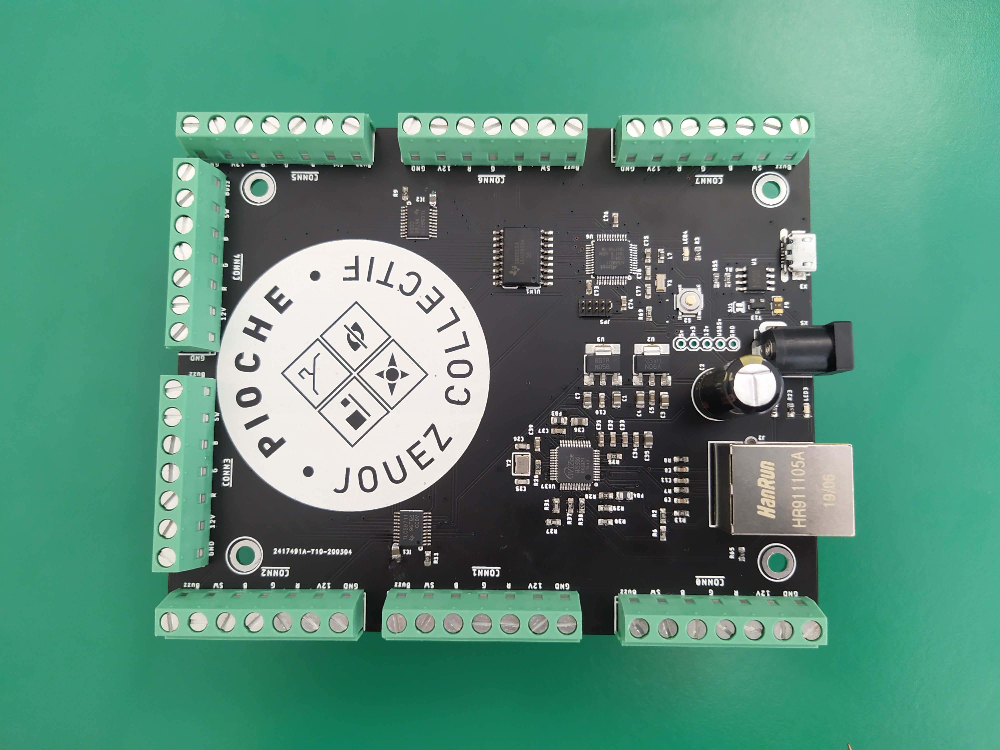

# Corpore Sano




## Node.js API

Please refer to `misc/Bumper.js` file. An example usage is available in `misc/demo.js`.

### Constructor:

```js
const bumper = new Bumper(boardId, bumperId, udpClient)
```

- `boardId` will be used to compute board IP and bumper id
- `bumperId` is the id of the bumper on the board
- `udpClient` is the client to send/receive messages

The bumper id is computed with the following : `id = boardId * 10 + bumperId`. So the bumper 4 of the board 3 have an id of 34.

### Methods:

#### `buzz`

```js
try {
  bumper.buzz(true) // turns on the buzzer
  setTimeout(() => {
    bumper.buzz(false) // turns off the buzzer
  }, 1000)
} catch (err) {
  console.log(err)
}
```

#### `rgb`

```js
try {
  bumper.rgb(r, g, b) // will turn the rgb led to the given r, g, b
} catch (err) {
  console.log(err)
}
```

Note: colors channels are 16bit encoded, so from 0 (0%) to 65535 (100%)

#### color aliases

```js
bumper.red() // 100% r, 0% g, 0% b
bumper.green() // 0% r, 100% g, 0% b
bumper.blue() // 0% r, 0% g, 100% b
bumper.white() // 100% r, 100% g, 100% b
bumper.black() // 0% r, 0% g, 0% b, rgb led is off
```

### Events:

#### `press`

```js
bumper.on('press', () => {
  // do what you want
})
```

#### `relesase`

```js
bumper.on('relesase', () => {
  // do what you want
})
```

## Various notes

### SERCOM2 SPI

#### Variant

| SAMD21 pin | Arduino pin | SERCOM PAD     | ALT or NOT     |
| ---------- | ----------- | -------------- | -------------- |
| PA14       | 2           | SERCOM2/PAD[2] | PIO_SERCOM     |
| PA09       | 3           | SERCOM2/PAD[1] | PIO_SERCOM_ALT |
| PA08       | 4           | SERCOM2/PAD[0] | PIO_SERCOM_ALT |
| PA15       | 5           | SERCOM2/PAD[3] | PIO_SERCOM     |

#### Pads selection

##### MISO

```cpp
typedef enum
{
  SERCOM_RX_PAD_0 = 0,
  SERCOM_RX_PAD_1,
  SERCOM_RX_PAD_2,
  SERCOM_RX_PAD_3
} SercomRXPad;
```

##### MOSI/SCK

```cpp
typedef enum
{
  SPI_PAD_0_SCK_1 = 0,
  SPI_PAD_2_SCK_3,
  SPI_PAD_3_SCK_1,
  SPI_PAD_0_SCK_3
} SercomSpiTXPad;
```

- I need SCK on PA15 (pin 5, pad 3), MOSI on PA08 (pin 4, pad 0)
- It gives me : SPI_PAD_0_SCK_3
- It then restricts MISO on pad 1 (PA09, pin 3) or 2 (PA14, pin 2)
- I choose pad 1 for no particular reason

So my SPIClass would be :

```cpp
// SPIClass SPI (&PERIPH_SPI, PIN_SPI_MISO, PIN_SPI_SCK, PIN_SPI_MOSI, PAD_SPI_TX, PAD_SPI_RX);
SPIClass SPI2(&sercom2, 3, 5, 4, SPI_PAD_0_SCK_3, SERCOM_RX_PAD_1);
```
